<p align="center">
  <picture>
  <source media="(prefers-color-scheme: light)" srcset="./assets/hero-light.d369d1e2.svg"/>
  
</picture>
</p>

<picture>
  <source media="(prefers-color-scheme: light)" srcset="./assets/divider-light.df9ed669.svg"/>
  
</picture>

### `$ whoami`

```python
orkhan = {
    "role":       "PhD student · Lab de Chémoinformatique, Université de Strasbourg",
    "working_on": "chemlit, an AI research agent: literature → hypotheses → code → results",
    "into":       ["LLM agents for chemistry", "de novo molecular design",
                   "chemical space analysis", "bayesian optimisation",
                   "microkinetic modelling"],
    "open_to":    ["research collaborations", "internships"],
    "email":      "orkhan.abdullayev@etu.unistra.fr",
}
```

<picture>
  <source media="(prefers-color-scheme: light)" srcset="./assets/divider-light.df9ed669.svg"/>
  
</picture>

### `$ pip list --toolbox`

<p align="center">
  <picture>
  <source media="(prefers-color-scheme: light)" srcset="./assets/toolbox-light.2cfa798b.svg"/>
  
</picture>
</p>

<picture>
  <source media="(prefers-color-scheme: light)" srcset="./assets/divider-light.df9ed669.svg"/>
  
</picture>
