<p align="center">
  <picture>
  <source media="(prefers-color-scheme: light)" srcset="./assets/hero-light.fb71d393.svg"/>
  
</picture>
</p>

<picture>
  <source media="(prefers-color-scheme: light)" srcset="./assets/divider-light.df9ed669.svg"/>
  
</picture>

### `$ whoami`

```python
orkhan = {
    "role":    "PhD student · Chemoinformatics Lab, Université de Strasbourg",
    "field":   "chemoinformatics × machine learning",
    "into":    ["LLM agents for chemistry", "de novo molecular design",
                "chemical space analysis", "bayesian optimisation",
                "microkinetic modelling"],
    "email":   "orkhan.abdullayev@etu.unistra.fr",
}
```

<picture>
  <source media="(prefers-color-scheme: light)" srcset="./assets/divider-light.df9ed669.svg"/>
  
</picture>

### `$ pip list --toolbox`

<p align="center">
  <picture>
  <source media="(prefers-color-scheme: light)" srcset="./assets/toolbox-light.f9fb010e.svg"/>
  
</picture>
</p>

<picture>
  <source media="(prefers-color-scheme: light)" srcset="./assets/divider-light.df9ed669.svg"/>
  
</picture>
