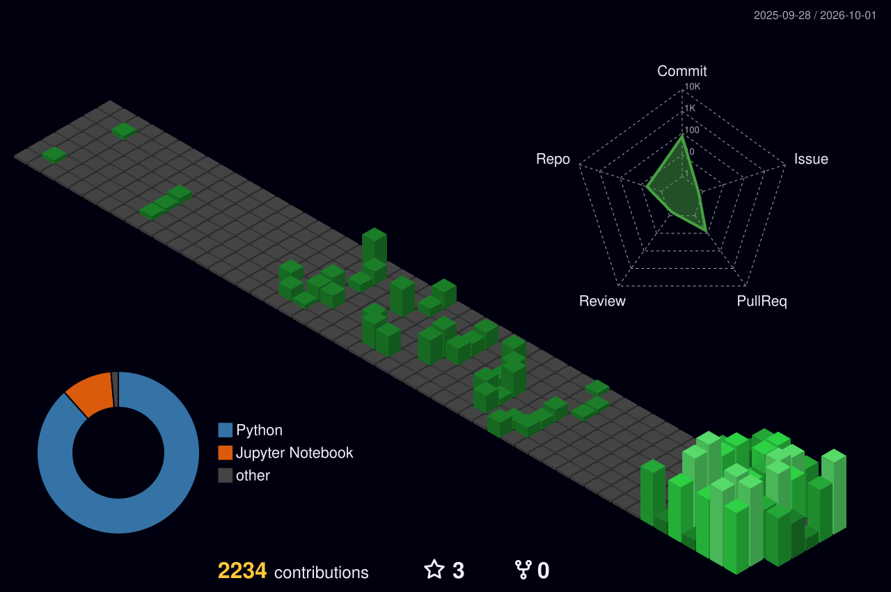

<p align="center">
  
</p>

<p align="center">
  <a href="https://www.linkedin.com/in/orkhanabdullayev2003"></a>
  <a href="https://github.com/0rkhann/chemlit"></a>
  
</p>


### `$ whoami`

```python
orkhan = {
    "field":     "chemoinformatics × machine learning",
    "based_in":  "Strasbourg, FR  ·  Université de Strasbourg",
    "building":  "LLM agents that read chemistry papers and cite every claim",
    "into":      ["generative molecular design", "chemical space maps (GTM)",
                  "microkinetic modelling", "retrieval + reranking"],
    "lab":       "EPFL LIAC",
}
```


### `$ ls projects/`

| | Project | What it does |
|:-:|---|---|
| 📚 | [**chemlit**](https://github.com/0rkhann/chemlit) | Citation-grounded literature discovery: hybrid search over OpenAlex, Semantic Scholar, PubMed and arXiv, cross-encoder reranking, PaperQA2 answers, RDKit / ChEMBL compound checks. |
| ⚗️ | [**MicroKatc**](https://github.com/0rkhann/MicroKatc) | Quantitative assessment of catalytic cycles with microkinetic modelling. |
| 🧬 | [**neptune**](https://github.com/0rkhann/neptune) | Branch of SATURN for peptidomimetics design. |
| 🗺️ | [**ChemographyKit**](https://github.com/0rkhann/ChemographyKit) | Chemical space mapping and visualisation. |
| 📉 | [**cdr_bench**](https://github.com/0rkhann/cdr_bench) | Benchmarking dimensionality reduction on chemical datasets. |


### `$ pip list --toolbox`

<p align="center">
  
</p>
<p align="center">
  
  
  
  
  
  
  
  
</p>


### `$ git log --stats`

<p align="center">
  
</p>

<p align="center">
  
</p>

<p align="center">
  
</p>

<p align="center">
  <picture>
    <source media="(prefers-color-scheme: dark)" srcset="./dist/snake-dark.svg"/>
    
  </picture>
</p>


<p align="center"><sub>Hero molecule is caffeine, drawn from RDKit 2D coordinates by <a href="./assets/make_art.py">assets/make_art.py</a>.</sub></p>
