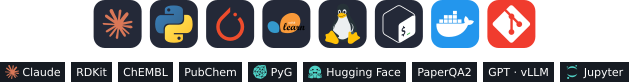

<p align="center">
  
</p>


### `$ whoami`

```python
orkhan = {
    "role":     "PhD student · Chemoinformatics Lab, Université de Strasbourg",
    "field":    "chemoinformatics × machine learning",
    "building": "LLM agents for chemistry",
    "into":     ["de novo molecular design", "chemical space maps (GTM)",
                 "Bayesian optimisation", "microkinetic modelling"],
    "contact":  "linkedin.com/in/orkhanabdullayev2003",
}
```


### `$ ls projects/`

| | Project | What it does |
|:-:|---|---|
| 📚 | [**chemlit**](https://github.com/0rkhann/chemlit) | Citation-grounded literature agent for chemoinformatics: hybrid search, cross-encoder reranking, PaperQA2 answers with claim-level citations, RDKit / ChEMBL compound checks. |
| ⚗️ | [**MicroKatc**](https://github.com/0rkhann/MicroKatc) | Quantitative assessment of catalytic cycles with microkinetic modelling. |
| 🎯 | **BO project** 🔒 | Bayesian optimisation for N-heterocyclic carbene (NHC) design, searching for optimal binding free energies with DFT in the loop. |
| 🧬 | [**neptune**](https://github.com/0rkhann/neptune) | Branch of SATURN for peptidomimetics design. |
| 🗺️ | **CoLiNN** 🔒 | Neural network that places combinatorial-library compounds on a GTM chemical space map from building blocks and reactions alone, with no enumeration. |


### `$ pip list --toolbox`

<p align="center">
  
</p>


### `$ plate-reader --last-year`

<p align="center">
  
</p>


<p align="center"><sub>Hero: caffeine generated token by token from its SMILES, laid out with RDKit coordinates by <a href="./assets/make_art.py">assets/make_art.py</a>.</sub></p>
