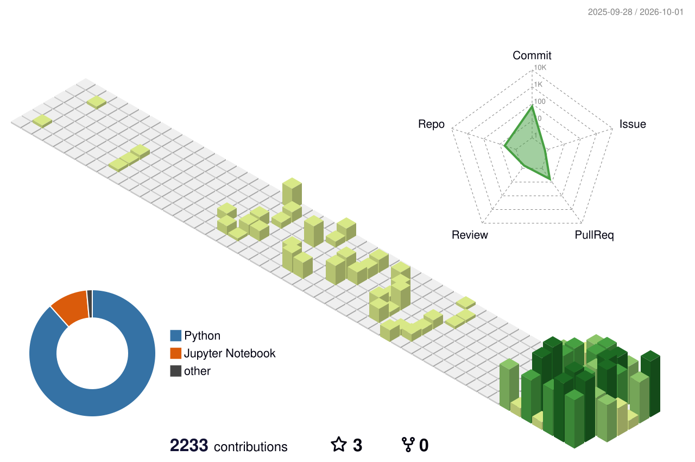

<p align="center">
  <a href="https://git.io/typing-svg"></a>
</p>

<p align="center">
  <a href="https://www.linkedin.com/in/orkhanabdullayev2003"></a>
  
  
</p>

```python
>>> from rdkit import Chem
>>> from rdkit.Chem import Descriptors
>>> me = Chem.MolFromSmiles("NC(=O)c1ccccc1")   # benzamide: small, stable, H-bond friendly
>>> round(Descriptors.MolWt(me), 2)
121.14
>>> interests = ["chemoinformatics", "molecular ML", "LLM agents", "computational chemistry"]
```

### 🧪 About

- Chemoinformatics student at the **Université de Strasbourg**, working where chemistry meets machine learning.
- Building **LLM agents** that read the literature and answer with verifiable, claim-level citations.
- Interested in **generative molecular design**, chemical space visualisation and microkinetic modelling.
- Contributor at **EPFL LIAC**.

### 🔬 Featured work

| Project | What it does |
|---|---|
| [**chemlit**](https://github.com/0rkhann/chemlit) | Citation-grounded literature discovery for chemoinformatics: hybrid search (OpenAlex, Semantic Scholar, PubMed, arXiv), cross-encoder reranking, PaperQA2 answers, RDKit / ChEMBL compound checks. |
| [**MicroKatc**](https://github.com/0rkhann/MicroKatc) | Quantitative assessment of catalytic cycles through microkinetic modelling. |
| [**neptune**](https://github.com/0rkhann/neptune) | Branch of SATURN for peptidomimetics design. |
| [**ChemographyKit**](https://github.com/0rkhann/ChemographyKit) | Chemical space mapping and visualisation (GTM). |
| [**cdr_bench**](https://github.com/0rkhann/cdr_bench) | Benchmarking dimensionality reduction on chemical datasets. |

### 🛠️ Toolbox

<p align="center">
  
</p>
<p align="center">
  
  
  
  
  
  
  
  
</p>

### 📈 Activity

<p align="center">
  
  
</p>

### 🏙️ Contribution city

<p align="center">
  <picture>
    <source media="(prefers-color-scheme: dark)" srcset="./profile-3d-contrib/profile-night-rainbow.svg"/>
    
  </picture>
</p>

<p align="center">
  <picture>
    <source media="(prefers-color-scheme: dark)" srcset="./dist/snake-dark.svg"/>
    
  </picture>
</p>


